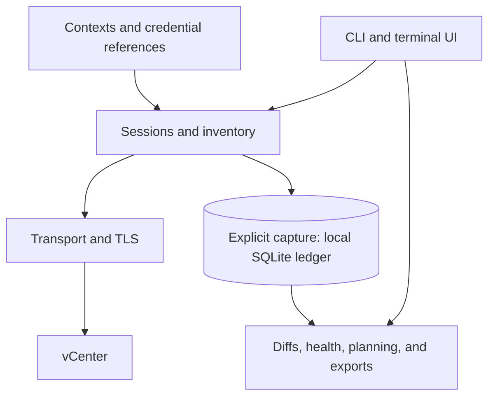

# Architecture

vsfleet has two data paths: live inventory reads from vCenter, and offline
queries over captured assessments. The CLI and terminal UI use the same
context, credential, transport, and assessment services.

## Data flow

A context groups a vCenter endpoint, username, credential reference, route, and
TLS policy. Live operations resolve that context, establish a session, and
read inventory through `internal/vsphere`. Each context can use direct TCP,
SOCKS5, or HTTP/HTTPS CONNECT independently.

Live reads use bounded concurrency and deadlines. Failures are attached to
their context or resource collection, so healthy results remain usable.
The TUI retains cached inventory when a refresh fails and shows its age.

Assessment capture persists observations and collection coverage. Offline
commands read those observations without opening a vCenter session. The
exporter reads a finished run in one SQLite transaction; XLSX and CSV use
the same worksheet builder and deterministic ordering.

Demo mode uses synthetic inventory and in-memory history without live
connections or persistent writes.

## Design rules

### Read-only vSphere access

`internal/vsphere` must never introduce inventory writes, power changes,
snapshot creation or reversion, provisioning, or deletion RPCs. SOAP audit
tests and dependency checks enforce this boundary. Local configuration,
UI state, and history maintenance have explicit write operations.

### Partial results retain coverage

A failed vCenter or resource collection must not discard healthy results.
Report the failure beside the available data. Stored diffs make lifecycle
claims only for contexts collected successfully in both runs; missing coverage
cannot imply that a VM disappeared.

### Configuration stores credential references

Passwords stay out of `config.toml`, UI state, logs, and the assessment ledger.
The credential resolver reads the OS keyring, an interactive masked prompt,
an environment variable, a file, or a helper. Setup offers alternatives when
the keyring is unavailable. Unattended sources fail explicitly when missing;
they never fall back to a prompt. See [Configuration](configuration.md#credentials).

### Context changes invalidate live state

Editing a context's route, username, or TLS policy closes its sessions and
clears its cached inventory. Removing a context logs out its session.
Context names are configuration labels; stored object correlation uses
vCenter identity and object identifiers.

### Captured observations are immutable

A capture records what vCenter returned at that time. Queries and exports
must preserve those observations and expose incomplete evidence.
VM matching uses managed-object references, then instance or BIOS UUIDs;
cross-context moves require unambiguous identity.

Performance windows are stored separately from inventory runs, keyed by
context and vCenter identity. They keep bounded summaries and provenance,
not raw samples. Pruning keeps each context's newest usable performance window.
See [Performance history](performance.md).

## Package responsibilities

| Area | Packages |
| --- | --- |
| Entrypoints and interface | `cmd/vsfleet`, `internal/cli`, `internal/tui` |
| Contexts and credentials | `internal/config`, `internal/contextops`, `internal/credentials` |
| Connections and live inventory | `internal/session`, `internal/transport`, `internal/limiter`, `internal/vsphere` |
| Inventory filtering and search | `internal/query`, `internal/search` |
| Stored captures, diffs, trends, and recovery | `internal/assessment` |
| Health and planning | `internal/health`, `internal/decommission`, `internal/sizing`, `internal/network`, `internal/topology` |
| Performance summaries | `internal/perf` |
| Export, import, and metadata reports | `internal/report`, `internal/rvimport`, `internal/metareport` |
| Workstation state and integrations | `internal/uistate`, `internal/sshalias`, `internal/update` |
| Formatting and build metadata | `internal/humanize`, `internal/version` |
| Synthetic development fixtures | `internal/demo`, `internal/testbed`, `cmd/vsfleet-demo`, `cmd/vsfleet-testbed` |

The pure performance semantics in `internal/perf` have no vSphere imports.
The wire-level `QueryPerf` implementation lives in
`internal/vsphere/perf_query.go`; importing govmomi's performance package
would pull mutation-capable packages across the read-only boundary.

`internal/report` builds both exports and the column descriptions shown by
`vsfleet compatibility report`. Describe new worksheet columns there so the
reference follows the exporter. Older captures must report missing evidence
through coverage rather than inventing values; see [Inventory exports](exports.md).

## Connection and refresh behavior

[Configuration](configuration.md#network-routes) owns route and TLS settings.
[Troubleshooting](troubleshooting.md#the-eight-stage-diagnostic-pipeline)
describes the ordered connection checks.
[Terminal UI](tui.md#refresh-and-cache-behavior) documents refresh intervals,
credential prompts, and stale-cache behavior.

## Development and verification

Use the [synthetic testbed](testbed.md) for UI development. Its presentation
profile is deterministic, offline, read-only, and visibly synthetic. Its
connected profile uses loopback services, fixture credentials, and isolated
state. Neither establishes compatibility with real vSphere.

[Testing](testing.md) explains the verification ladder and real-vCenter
acceptance limits; [Test catalogue](test-catalog.md) maps suites to scenarios.
